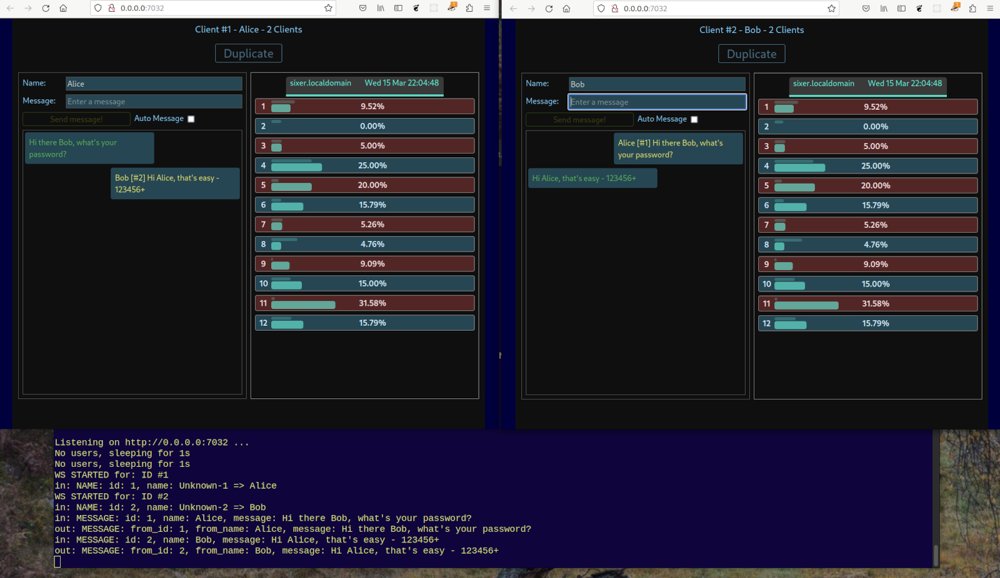

# Axact

## Original Source

- [fasterthanlime - YouTube channel](https://www.youtube.com/@fasterthanlime)
- [YouTube live coding video - "Let's make an htop-like in your browser (with Rust)"](https://youtu.be/c_5Jy_AVDaM)
- [GitHub repo - axact](https://github.com/fasterthanlime/axact)

## Fork Changes

- Added Chat support to existing Rust and Preact apps
- Rust app refactored into modules
- Improved and refactored UI
    - CSS updates
    - Created Preact components
    - Moved Websocket creation into app
- Screenshot

### Running

- Ensure that you have rust installed
    - Start the Rust app using: `cargo run`
    - Click on the `Listening on http://...` link to open the UI

## Other Forks

- Using yeap instead of preact and tower backend: <https://github.com/hanako-eo/axact>

- Visualizing 128 cores: <https://github.com/useafterfree/axact>

